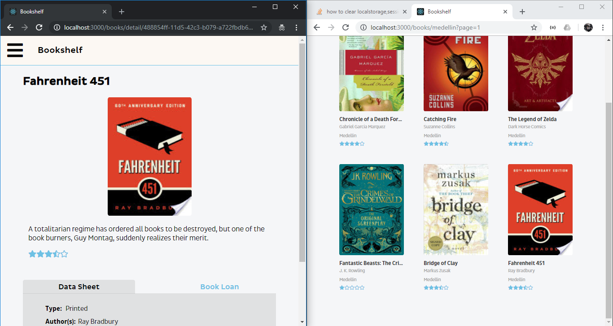
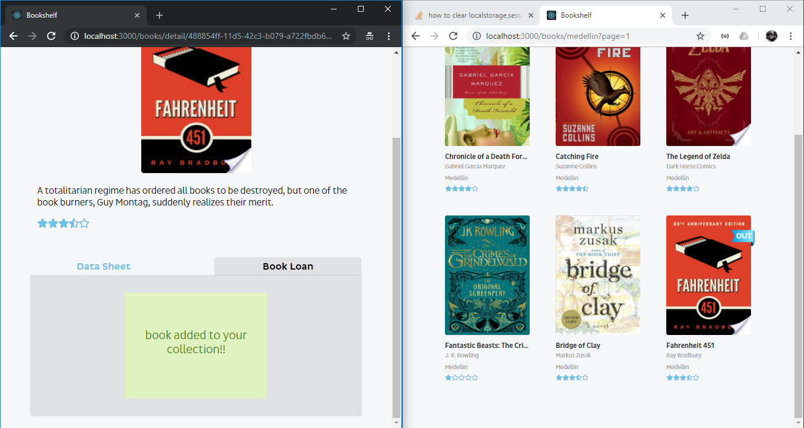

# Bookshelf Front-End

### Instructions

1. Before follow this instructions complete the instrucction in the server side.

2. Install the dependencies.

   ```bash
   npm install
   ```

5. Then run the Project.

   ```bash
   npm start
   ```

   Project: http://localhost:3000/

   API:  http://localhost:3001/


   You can use one of the following users:

| User 1                                                       | User 2                                                       |
| ------------------------------------------------------------ | ------------------------------------------------------------ |
| email: [user-1@jobsity.com](mailto:user-1@jobsity.com) password: pass001 | email: [user-2@jobsity.com](mailto:user-2@jobsity.com) password: pass002 |

The new features added to the project are:

- Log Out button.

- WebSocket implementation for loaned books.

  

  When an user loan the book, the info about that book in another client is automatically update.

  

- Ajax petitions with RxJS.